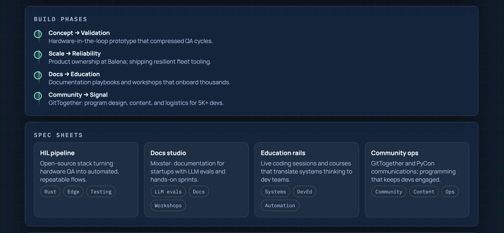
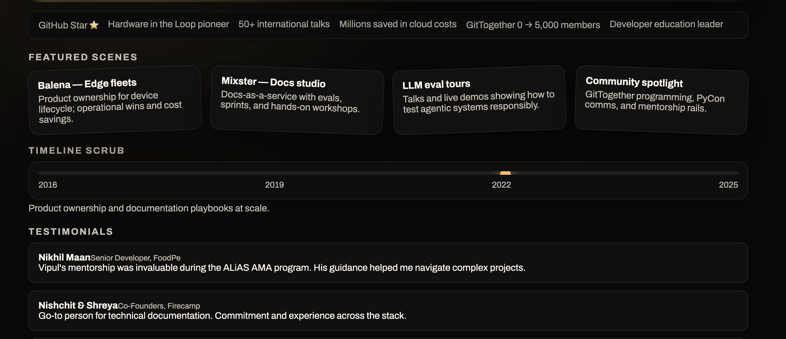
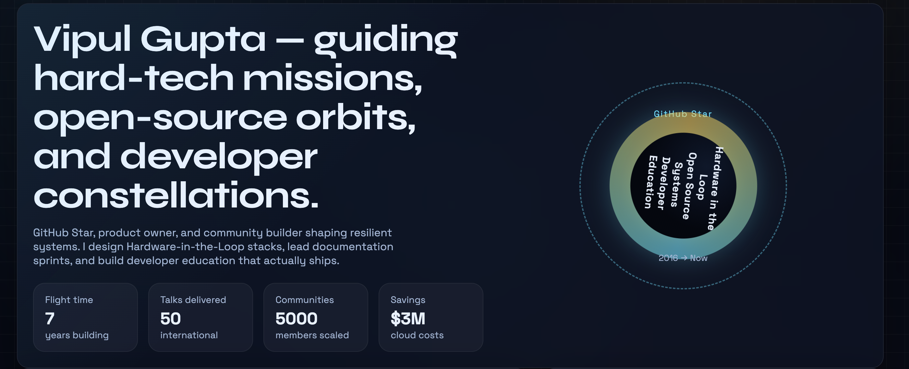

# Frontend Design Skill

> A Codex agent skill for creating distinctive, production-grade frontend interfaces with high design quality.

## What is this?

This is an **agent skill** for [OpenAI Codex](https://developers.openai.com/codex/skills) - the AI-powered coding agent. Skills extend Codex's capabilities by providing specialized knowledge, workflows, and tools for specific domains.

## Previews

| Skill Overview | Skill Activation | Output Example |
|:--------------:|:----------------:|:--------------:|
|  |  |  |


## Installation

### Option 1: Manual Installation (Recommended)

Copy the `frontend-design/` folder to one of these locations:

| Scope | Location | Use Case |
|-------|----------|----------|
| **User** | `~/.codex/skills/` | Personal skills available in all projects |
| **Repo** | `.codex/skills/` (in repo root) | Team skills shared via version control |
| **Admin** | `/etc/codex/skills/` | System-wide skills for all users |

```bash
# User scope (personal)
cp -r frontend-design ~/.codex/skills/

# Repo scope (team)
mkdir -p .codex/skills
cp -r frontend-design .codex/skills/
```

### Option 2: Using skill-installer

```bash
# In Codex CLI, use the skill-installer
$skill-installer frontend-design --from vipulgupta2048/frontend-design-skill
```

## Skill Structure

```
frontend-design/
├── SKILL.md                          # Main skill instructions (required)
├── references/
│   ├── aesthetic-playbook.md         # Design direction presets
│   └── implementation-patterns.md    # Code patterns & recipes
└── assets/
    └── vanilla-starter/              # Ready-to-use starter template
        ├── index.html
        ├── style.css
        └── script.js
```

## How It Works

### Automatic Activation
Codex will automatically activate this skill when your task involves:
- Building or refining web components, pages, or apps
- Working with HTML/CSS/JS/React
- Requests for bold aesthetics, purposeful layouts, or motion design
- Accessibility-focused frontend work

### Explicit Activation
In Codex CLI, mention the skill directly:
```
$frontend-design Create a landing page for a tech startup
```

## What This Skill Provides

1. **Aesthetic Directions** - Pre-defined design systems (Brutalist, Editorial, Retro-Futuristic, Soft Craft, Industrial)
2. **Implementation Patterns** - Code recipes for layouts, motion, responsive design, and accessibility
3. **Starter Template** - A production-ready vanilla HTML/CSS/JS concept with:
   - CSS custom properties for theming
   - Gradient backgrounds with grain texture
   - Staggered reveal animations
   - Accessible structure with skip links
   - Responsive design

## Usage Examples

```
# Create a landing page with a specific aesthetic
Create a brutalist portfolio page with oversized typography

# Refine existing UI
Add subtle motion and polish to this React component

# Build with constraints  
Design a dark mode dashboard with industrial aesthetics, accessible for screen readers
```

## Learn More About Codex Skills

- [Official Skills Documentation](https://developers.openai.com/codex/skills)
- [Create Custom Skills](https://developers.openai.com/codex/skills/create-skill)
- [Agent Skills Specification](https://agentskills.io/)
- [Codex CLI Repository](https://github.com/openai/codex)

## License

MIT License - Feel free to use, modify, and distribute.

## Author

Created by [Vipul Gupta](https://github.com/vipulgupta2048)
